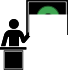

<!-- use with marp editor-->

<!-- $size: 16:9
$author: Adrian Salamon
$date: 2018-07-26
$title: Die unfreie Lehrkraft – Ausbruch aus dem Gefängnis der Abhängigkeit
$theme: gaia
template:invert
-->


# Die unfreie Lehrkraft mit demokratisch pluralistischem Bildungsauftrag in einer von Monopolen geprägten digitalen Welt – Ausbruch aus der Abhängigkeit

Adrian Salamon
tarent solutions GmbH


---
## Abstract

Wir leben und arbeiten in einer dystopischen Welt, in der proprietäre Software alles dominiert. Hausaufgaben gibt's per Dropbox, Klausurergebnisse per Facebook und die Klassenfahrt wird offiziell über WhatsApp organisiert. Aber auch während des Unterrichts dominieren unfreie Systeme und Werkzeuge und unsere Lern- und Arbeitsweisen.

Ist das alles mit den Zielen digitaler Medienbildung konform? Könnte Freie Software uns aus diesem Gefängnis der Abhängigkeit befreien?

Beobachtungen aus der Perspektive der Schulinformatik.

---


<!--footer: Adrian Salamon, 2018. cc-by 4.0 -->


## Aufgaben der Lehrkraft:
* Vermitteln von Fachinhalten
* gesellschaftliche Vorbildfunktion im demokratischen Gedanken
		(Schulgesetz §2: Bildungs- und Erziehungsauftrag,)
* Fördern "digitaler Medien" (Medienbildung)

`(wir kommen später darauf zurück)`

---

### Lernen mit Medien – eine Darstellung des dystopischen Alltags

* iPads + AppleTV
* Google Docs
* Dropbox
* WhatsApp Gruppen -> DSGVO? Informationelle Selbstbestimmung?
* Smartboard Anwendersoftware

---

### Was braucht die durchschnitts Lehrkraft an digitalen Werkzeugen? 
* Betriebssystem
* Bürosoftware
	- Textverarbeitung
	- Tabellenkalkulation
	- Präsentationen
* Texteditor
* Webbrowser

---

### Spezielle Werkzeuge
* Bildberarbeitung
* Videoschnitt
* Musikproduktion

---

### Social Media
* Facebook
* Twitter
* Instagram


```text
Hier ist wichtig:
Für welche Zwecke werden die Dienste eingesetzt?
 * Zum übermitteln von Noten und Hausaufaben sind sie unzulässig
 * Um gemeinsame Lernergebnisse mit der Welt zu teilen, kann es ok sein
```

--- 

### Was sagen Nutzungsrechte über Benutzer aus?
* Wer darf was auf Schulrechner installieren? Nicht jede Lehrkraft
* Was dürfen Schülerinnen installieren? Gar nichts.

> _Einschränkungen vermitteln ein Bild von Hilflosigkeit, wenn wir doch eigentlich Hilfe zur Selbsthilfe geben wollen und zeigen wollen, dass wir in der Lage sind die Maschine zu kontrollieren, nicht umgekehrt._


**Habt Mut zur Freiheit** (und Systembackups)

---

### und das Lehrerleben… 
* Dropbox für Materialaustausch
* Noteneingabe über eine proprietäre uralt Software
* "Cloudspeicher"-Software von Schulbuchverlagen
* MS Word. Für alles. Wirklich alles.

`(bitte in Zukunft alles nicht mehr benutzen)`

---

## Problematisierung


§3 Schulische Selbstständigkeit, Eigenverantwortung, Qualitätsentwicklung und -sicherung
? Multiperspektivisch 

§99 Sponsoring, Werbung
Jede Werbung, die nicht schulischen Zwecken dient, ist in der Schule unzulässig.
	!Produkt, wohl aber Kompetenzen zur Benutzung vermitteln!


* Wie objektiv kann ein proprietäres Werkzeug sein?
* Es muss geeicht sein von einer unabhänigen Stelle

	* Was, wenn Google/Facebook/etc. bestimmte Beiträge rausfiltert?
	* Was, wenn meine Entwicklungsumgebung nur noch eine Programmiersprache unterstützt?
	* Was, wenn unsere Regierung Abhängig vom den größten amerikanischen Unternehmen ist?

---

### SaaS

* Selber hosten? [lel]
	- Netzwerkdateisystem
	- Chatsysteme
	- Soziale Medien
	- Lernplattformen


---

## FOSS als Grundlage digitaler Selbstverteidigung
* Sehen/bearbeiten/lesen von Quelltext <!-- -> Transparenz -->
* Wahlmöglichkeiten <!-- -> Weniger Abhängigkeiten von einem bestimmten Hersteller/Marke -->
* Keine/weniger Lizenzgebüren (FOSS != kostenlos)
* mehr Schutz vor NSA, Bundestrojaner etc.
* weniger Einfluss von Konzernen auf unser Konsum- und Kommunikationsverhalten

__Kann der gläserne Bürger ein mündiger Bürger sein?__

---
### Handfeste Hinweise für schulinterne Kommunikation
* Firefox/Chromium statt Google Chrome/Safari/Edge
* Seafile statt Dropbox
* Diaspora statt Facebook
* GnuSocial statt Twitter
* Moodle statt nicht Moodle
* XMPP statt WhatsApp
* NextCloud als (verschlüsselte) Dateiablage, Kalender, Kontakte, (Video-)Chatplattform, kollaboratives Arbeiten uvm.

---

### (richtige) Aufgaben der Lehrkraft bezüglich digitaler Medien

1) Befähigen zum zielgerichtetem Einsetzen und Konfigurieren von Software
1) Befähigen zur Gestaltung von von Informatiksystemen (programmieren)
1) Mündiges leben mit Informatiksystemen vermitteln und vorleben



---
### Linksammlung für Softwareempfehlungen


| Link | Beschreibung  |
|:------------ |:-------------|
|https://prism-break.org/de/ | Alternativen zu proprietärer  Software 
|https://github.com/Kickball/awesome-selfhosted | (freie) Software selber hosten

---
# Vielen Dank


