<!-- start locally with
	reveal-md PITCHME.md --css slidestyle.css -w --theme white
-->


<!-- For use with marp editor: -->
<!-- $size: 16:9
$author: Adrian Salamon
$date: 2018-08-23
$title: Die unfreie Lehrkraft – Ausbruch aus dem Gefängnis der Abhängigkeit
$theme: gaia
template:invert
-->


# Die unfreie Lehrkraft mit demokratisch pluralistischem Bildungsauftrag in einer von Monopolen geprägten digitalen Welt 

<div class="mydata">
23.08.2018 <br>
Adrian Salamon <br>
tarent solutions GmbH
</div>


----
With (some) illustrations of

```Text
FreeSoftware TEDx slides
Christian Noguera, Valentin Pasquier, Richard Stallman
Released under CC-BY 3.0 license
Copyright 2014
```
<!-- Info: every image without a source is made by Noguera, Pasquier and Stallman -->


<div style="display:none">
## Abstract

Wir leben und arbeiten in einer dystopischen Welt, in der proprietäre Software alles dominiert. Hausaufgaben gibt's per Dropbox, Klausurergebnisse per Facebook und die Klassenfahrt wird offiziell über WhatsApp organisiert. Aber auch während des Unterrichts dominieren unfreie Systeme und Werkzeuge und unsere Lern- und Arbeitsweisen.

Ist das alles mit den Zielen digitaler Medienbildung konform? Könnte Freie Software uns aus diesem Gefängnis der Abhängigkeit befreien?

Beobachtungen aus der Perspektive der Schulinformatik.

---
</div>


<!--footer: Adrian Salamon, 2018. cc-by 4.0 -->


## Was ist Software?

* Programme
* Apps
* Webapps
* Hardwaresteuerung
* …

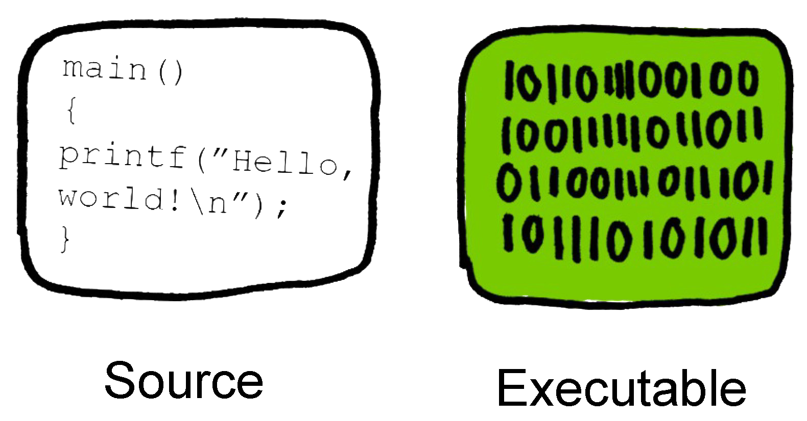


---

### Freie Software bedeutet, jeder hat die Freiheit…

* das Programm auszuführen wie man möchte.
* die Funktion des Programms zu untersuchen anzupassen. 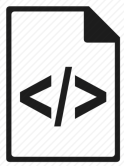
* das Programm zu verteilen.
* das Programm zu verbessern. 

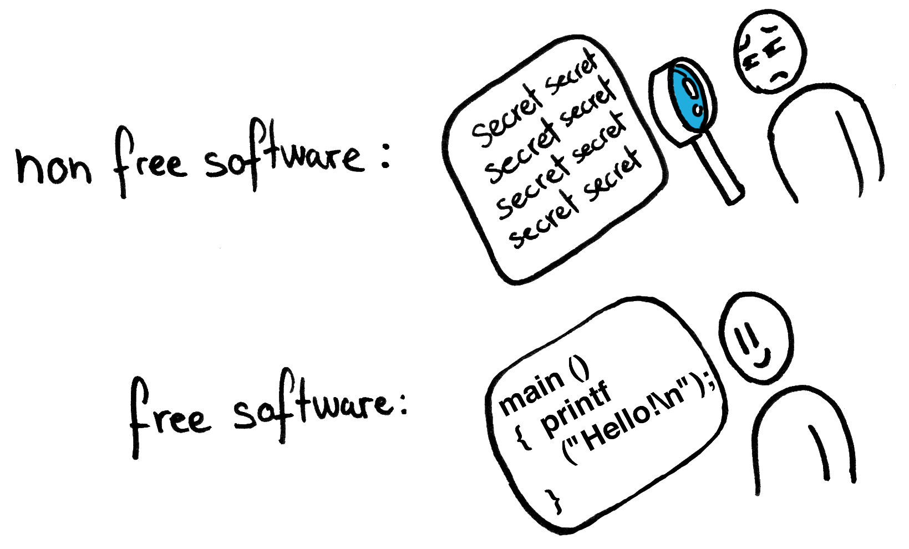


Note: 
* Freie Software verkaufen (RedHat/Fedora)
	- Premium: Nextcloud, Seafile, Emby…
* Freies Wissen verkaufen (Wikipedia)


---

### Free Software ≥ Open Source?

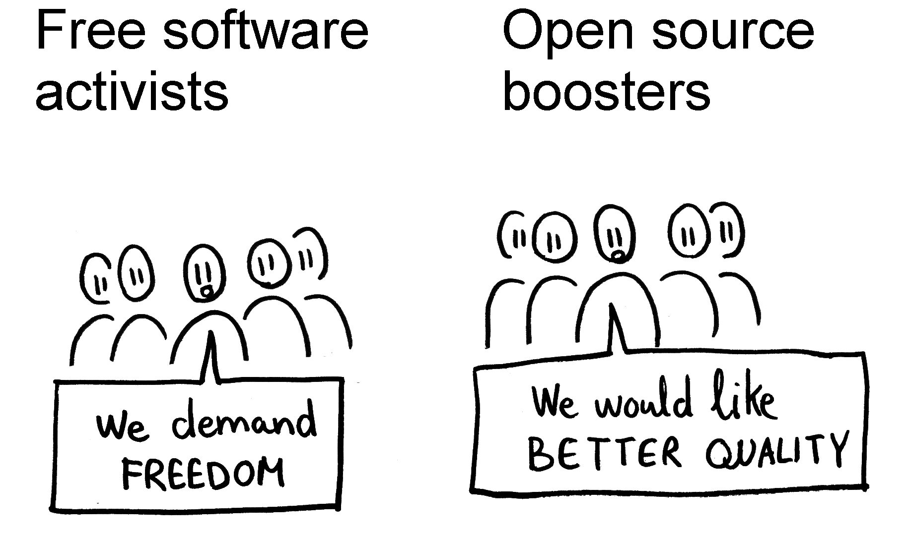


* https://www.gnu.org/philosophy/free-software-for-freedom.de.html
* https://www.gnu.org/philosophy/open-source-misses-the-point.de.html

---

## Aufgaben der Lehrkraft


<div class="fullsize"> 
<ul>
  <li> Vermitteln von Fachinhalten </li>
	<li> Beurteilen </li>
  <li> Erziehen  Werte und Normen im demokratischen Gedanken </li>
  <li> Fördern "digitaler Medien" (Medienbildung) </li>
</ul>
</div>


Note:
* Schulgesetz §2: Bildungs- und Erziehungsauftrag
* Werzeuge <> Medien?

---

### Digitales Lernen – eine Darstellung des dystopischen Alltags

* iPads + AppleTV
* Microsoft Office
* Dropbox
* WhatsApp Gruppenchats
* Smartboard Anwendersoftware

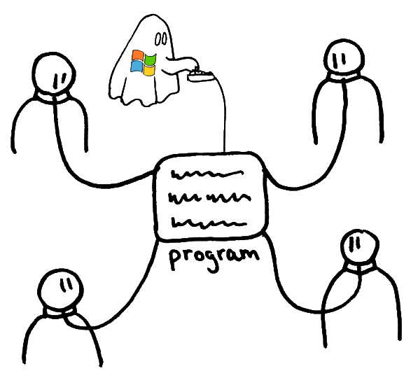

Note:
* Daten speichern: DSGVO
* Daten verteilen: Recht auf Informationelle Selbstbestimmung (Tel-Nr, Name, Adressbuch…)

<!-- Quellen:
	https://www.datenschutzticker.de/2017/07/abmahnung-fuer-whatsapp-nutzer/
-->
---

### Digitale Werkzeuge in der Lehre 
* Betriebssystem
* Bürosoftware
* Texteditor
* Webbrowser
* Bildberarbeitung
* Videoschnitt
* Musikproduktion

* Kommunikationstools
* Social Media

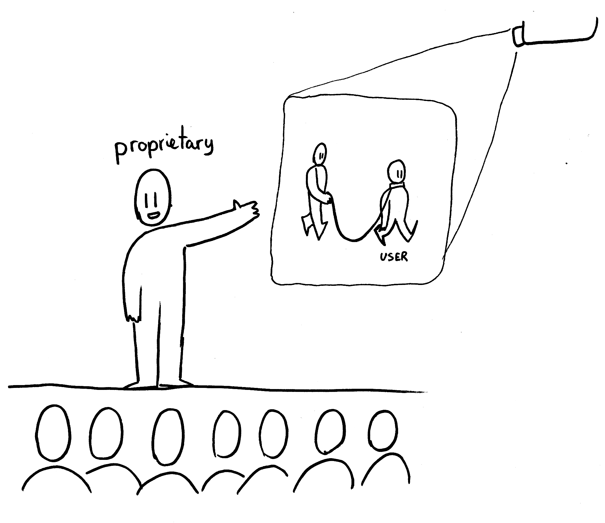


Note:
* Abhängigkeiten durch Vertrieb
* Abhängigkeiten durch falsche "Standards"
* Abhängigkeiten durch Gewohnheit

---

### und das Lehrerleben… 
* Dropbox für Materialaustausch
* Noteneingabe über eine proprietäre uralt Software
* "Cloudspeicher"-Software von Schulbuchverlagen
* MS Word. Für alles. Wirklich alles.

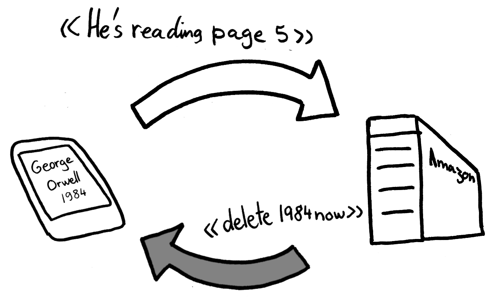 <!-- image modifiedy by Adrian Salamon 2018 -->

Note:
* Bsp: lo-net2
* Monopole werden gelebt und gefördert
* 

---


### "Nur" ein Lernwerkzeug?

* TODO WERBUNG

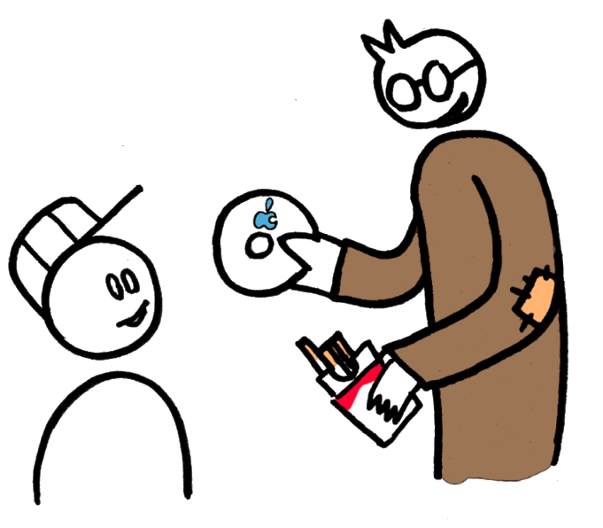

Note: §99 Sponsoring, Werbung
	- »Jede Werbung, die nicht schulischen Zwecken dient, ist in der Schule unzulässig.«
	- Kein Produkt, wohl aber Kompetenzen zur Benutzung vermitteln!
	- Windows, Appe, Whatsapp, Facebook…

---

### Es gibt keine Standardsoftware


* Defakto keine standartisierten Formate!
* Keine "must have" Software!
* Zeigt fehlende Kompetzenzorientierung in der Didaktik!

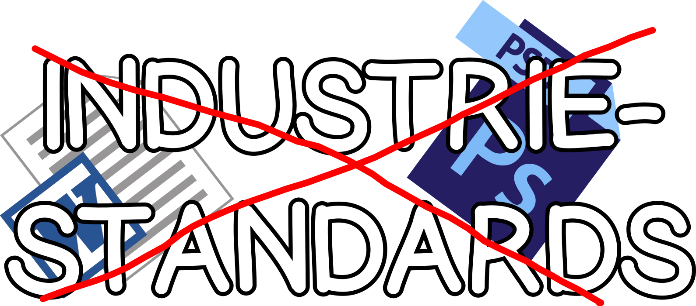 <!-- Remix of following images: http://valsparchampionship.com/microsoft-word-icon/  http://www.myiconfinder.com/icon/photoshop-ps-metro-ui-adobe-logo-application-design-software-edit-file-format/12439 -->

Note:
* Klickkompetenzt
* Beim nächsten Update: Keiner kann etwas
* Investition in Herstellerunabhängige Fertigkeiten!
* Software und Arbeitsweise damit mit Bedacht wählen!


---


### Lehrkraft und Computer – Wer kontrolliert wen?

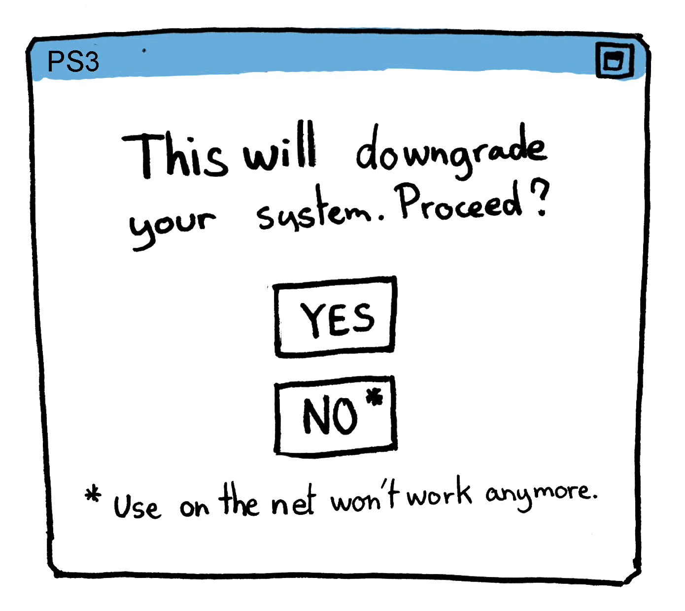

Note:
* Wer darf was auf Schulrechner installieren? Nicht jede Lehrkraft
* Was dürfen Schülerinnen installieren? Gar nichts.
* Einschränkungen vermitteln ein _Bild von Hilflosigkeit_, wenn wir doch eigentlich _Hilfe zur Selbsthilfe_ geben wollen und zeigen wollen, dass wir in der Lage sind die Maschine zu kontrollieren, nicht umgekehrt.


---

## Aspekte Freier Software 

* Vertrauen
* Unabhängigkeit
* Anpassbarkeit

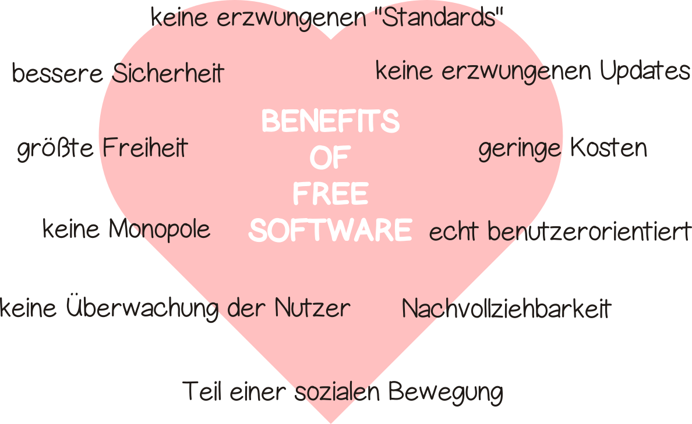 <!-- image created by Adrian Salamon 2018 CC-BY -->


---

### Vertrauen
#### "Macht das Programm genau das, was ich will?"


* Wie objektiv kann ein proprietäres Werkzeug sein?
* Was, wenn Google/Facebook/etc. bestimmte Beiträge rausfiltert?
* Was, wenn unsere Regierung abhängig vom den größten amerikanischen Unternehmen ist?


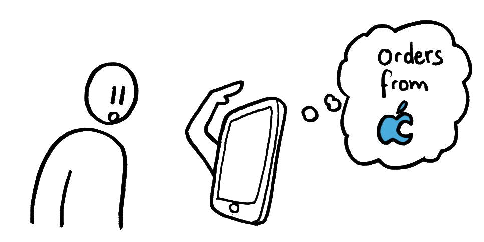

Note:
* Objektiv: Es muss geeicht sein von einer unabhänigen Stelle
* §3 Schulische Selbstständigkeit, Eigenverantwortung, Qualitätsentwicklung und -sicherung
* Multiperspektivisch (did)

* Was, wenn meine Entwicklungsumgebung nur noch eine Programmiersprache unterstützt?


---

### Unabhängigkeit

#### "Ich will nichts installieren": Software as a service

* Netzwerkdateisystem
* Chatsysteme
* Soziale Medien
* Lernplattformen
* _⇒ Freie Schnittstellen/Formate verwenden!_

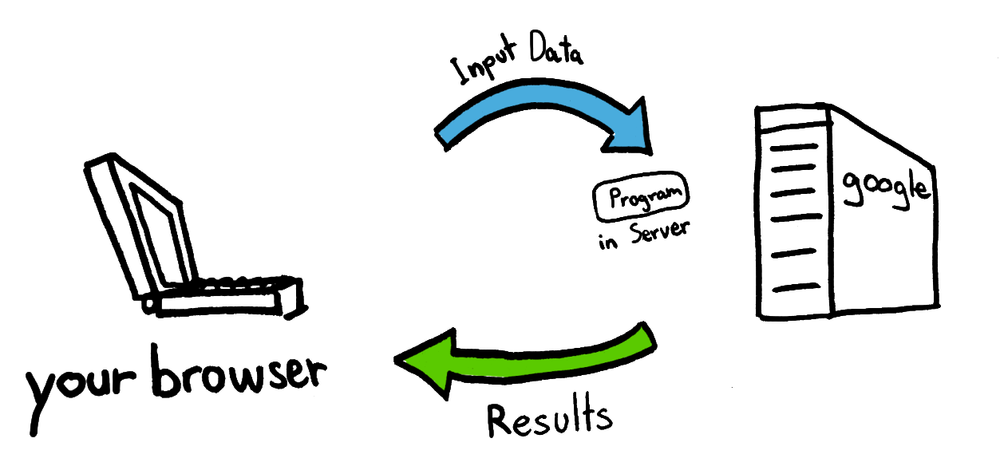

---


### Anpassbarkeit
#### "Wir brauchen das ein bisschen anders…"
* (graphical) user interface
* Rechteverwaltung
* Austauschbarkeit

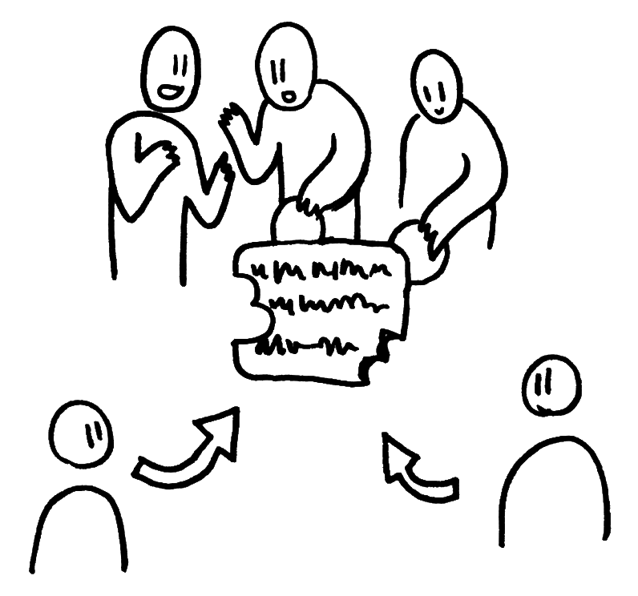

Note: Ebene Konfiguration oder Kompilierung

---

### FOSS als Grundlage digitaler Selbstverteidigung
* sehen/bearbeiten/lesen von Quelltext
* Wahlmöglichkeiten 
* Keine/weniger Lizenzgebüren 
* mehr Schutz vor NSA, Bundestrojaner…
* weniger Einfluss von Konzernen auf unser Konsum- und Kommunikationsverhalten

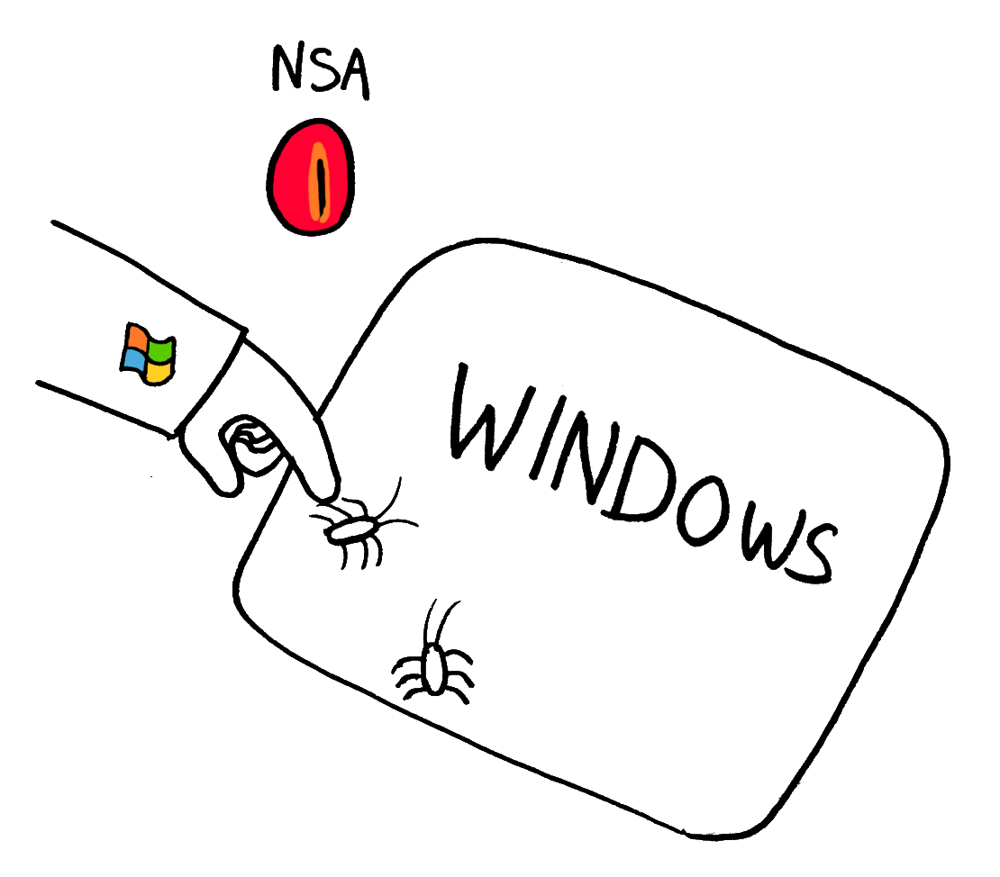

Note:
* Grundkompetenzen im digitalen Zeitalter
* Weniger Abhängigkeiten von einem bestimmten Hersteller/Marke
* FOSS != kostenlos
* Kann der gläserne Bürger ein mündiger Bürger sein?

---


## Lasst uns so lehren…

* mit Freier Software (Unabhängigkeit)
* an Freier Software (Codeanalyse)
* für Freie Software (Erziehungsauftrag)


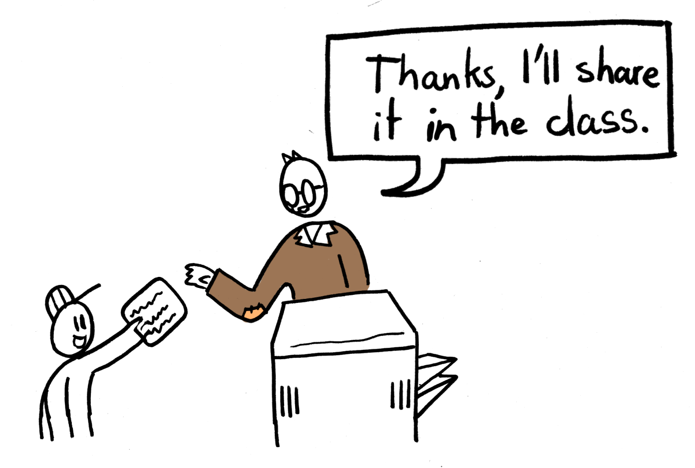


Note: 
* moralischer Mehrwert
* sharing is caring
* Erziehung: Einander helfen

---

### (richtige) Aufgaben der Lehrkraft bezüglich digitaler Werkzeuge

* zielgerichtet einsetzen
* bewusst gestalten
* mündig leben

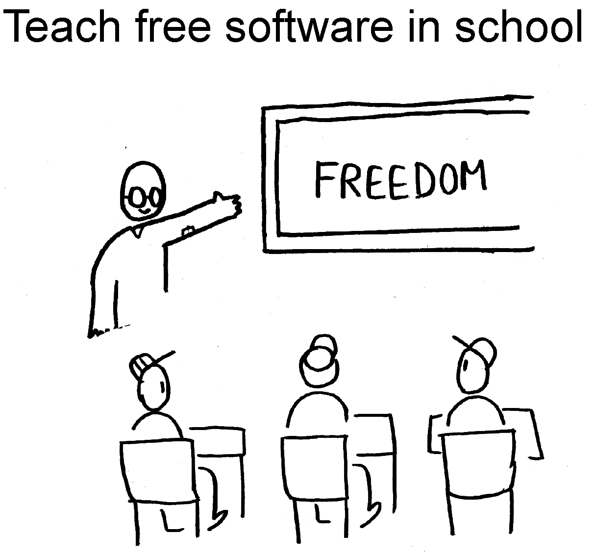


Note:
* Befähigen zum zielgerichtetem Einsetzen von Software
* Befähigen zur Gestaltung von von Informatiksystemen
* Mündiges leben mit Informatiksystemen vermitteln und vorleben

---


### Freie Alternativen im Bildungsalltag

* __Firefox/Chromium__ statt Google Chrome/Safari/Edge
* __Seafile__ statt Dropbox
* __Diaspora__ statt Facebook
* __GnuSocial__ statt Twitter
* __Moodle__ statt nicht Moodle
* __XMPP__ statt WhatsApp
* __Libre Office__ statt Microsoft Office
* __NextCloud__ als Daten- und Kommunikationsplattform

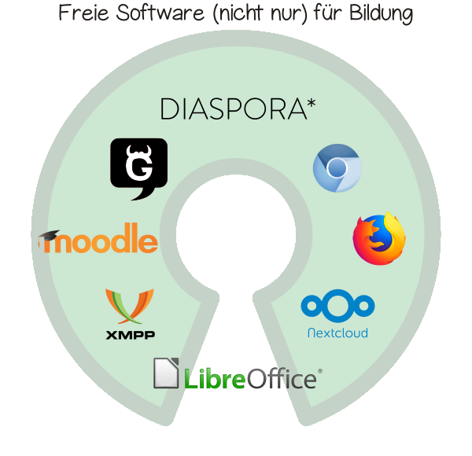 <!-- image created by Adrian Salamon 2018 CC-BY -->

Note:
	(verschlüsselte) Dateiablage, Kalender, Kontakte, (Video-)Chatplattform, kollaboratives Arbeiten uvm.

---
### Linksammlung für Softwareempfehlungen

| Link | Beschreibung  |
|:------------ |:-------------|
|https://prism-break.org/de/ | Alternativen zu proprietärer  Software 
|https://github.com/Kickball/awesome-selfhosted | (freie) Software selber hosten

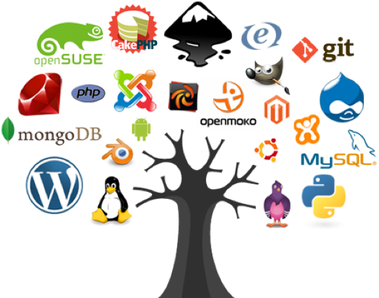 <!--image taken from https://soldecom.com/wp-content/uploads/2016/05/Picture1.png -->

---
# Vielen Dank

Note:
* Zuhörer
* Veranstalter
* tarent


