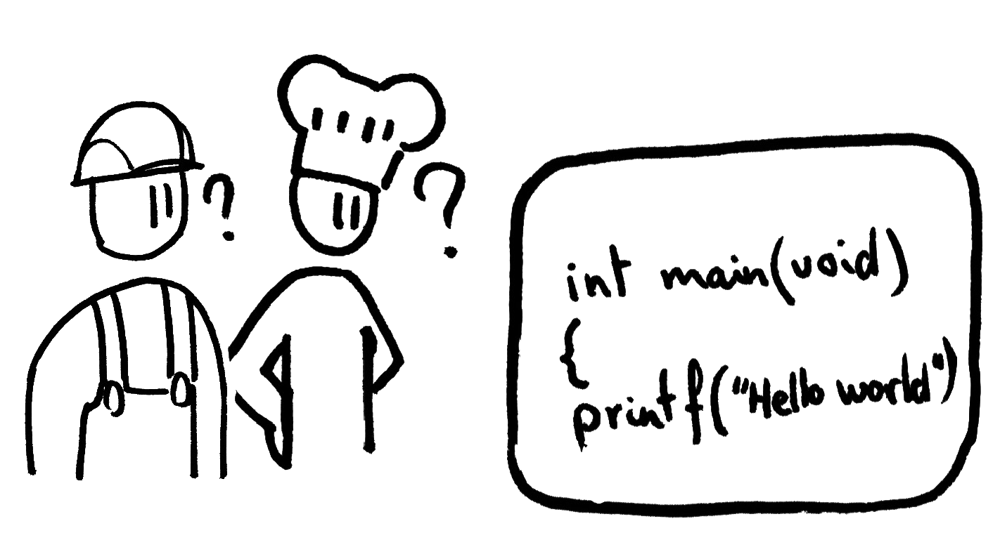

<!-- start with
	reveal-md PITCHME.md --css slidestyle.css -w --theme white
-->


<!-- use with marp editor-->

<!-- $size: 16:9
$author: Adrian Salamon
$date: 2018-08-23
$title: Die unfreie Lehrkraft – Ausbruch aus dem Gefängnis der Abhängigkeit
$theme: gaia
template:invert
-->


# Die unfreie Lehrkraft mit demokratisch pluralistischem Bildungsauftrag in einer von Monopolen geprägten digitalen Welt 

<div class="mydata">
23.08.2018 <br>
Adrian Salamon <br>
tarent solutions GmbH
</div>


---
With illustrations of

```Text
FreeSoftware TEDx slides
Christian Noguera, Valentin Pasquier, Richard Stallman
Released under CC-BY 3.0 license
Copyright 2014
```

<div style="display:none">
## Abstract

Wir leben und arbeiten in einer dystopischen Welt, in der proprietäre Software alles dominiert. Hausaufgaben gibt's per Dropbox, Klausurergebnisse per Facebook und die Klassenfahrt wird offiziell über WhatsApp organisiert. Aber auch während des Unterrichts dominieren unfreie Systeme und Werkzeuge und unsere Lern- und Arbeitsweisen.

Ist das alles mit den Zielen digitaler Medienbildung konform? Könnte Freie Software uns aus diesem Gefängnis der Abhängigkeit befreien?

Beobachtungen aus der Perspektive der Schulinformatik.

---
</div>


<!--footer: Adrian Salamon, 2018. cc-by 4.0 -->

## Preambel: Freie Software

Jeder hat die Freiheit…

* das Programm auszuführen wie man möchte.
* die Funktion des Programms zu untersuchen anzupassen. 
* das Programm zu verteilen.
* das Programm zu verbessern. 



Note: 
* Freie Software verkaufen (RedHat/Fedora)
	- Premium: Nextcloud, Seafile, Emby…
* Freies Wissen verkaufen (Wikipedia)


---

### Free Software ≥ Open Source?


siehe 
* https://www.gnu.org/philosophy/free-software-for-freedom.de.html
* https://www.gnu.org/philosophy/open-source-misses-the-point.de.html

---

## Aufgaben der Lehrkraft:
* Vermitteln von Fachinhalten
* gesellschaftliche Vorbildfunktion im demokratischen Gedanken
* Fördern "digitaler Medien" (Medienbildung)

> wir kommen später darauf zurück

Note: Schulgesetz §2: Bildungs- und Erziehungsauftrag


---

### Lernen mit Medien – eine Darstellung des dystopischen Alltags

* iPads + AppleTV
* Microsoft Office
* Dropbox
* WhatsApp Gruppenchats
* Smartboard Anwendersoftware


Note: DSGVO? Informationelle Selbstbestimmung?

---
### "Nur" ein Lernwerkzeug?

* TODO WERBUNG


Note: §99 Sponsoring, Werbung
	- > Jede Werbung, die nicht schulischen Zwecken dient, ist in der Schule unzulässig.
	- !Produkt, wohl aber Kompetenzen zur Benutzung vermitteln!
	- Windows, Appe, Whatsapp, Facebook…

---

### Allgemeine digitale Werkzeugen für Lehrkräfte 
* Betriebssystem
* Bürosoftware
* Texteditor
* Webbrowser


### Spezielle digitale Werkzeugen für Lehrkräfte 
* Bildberarbeitung
* Videoschnitt
* Musikproduktion

---

### Social Media
* Facebook
* Twitter
* Instagram

Note:
> Hier ist wichtig:
> Für welche Zwecke werden die Dienste eingesetzt?
>  * Zum übermitteln von Noten und Hausaufaben sind sie unzulässig
>  * Um gemeinsame Lernergebnisse mit der Welt zu teilen, kann es ok sein

---

### Lehrkraft und Computer – Wer kontrolliert wen?


Note:
* Wer darf was auf Schulrechner installieren? Nicht jede Lehrkraft
* Was dürfen Schülerinnen installieren? Gar nichts.

> _Einschränkungen vermitteln ein Bild von Hilflosigkeit, wenn wir doch eigentlich Hilfe zur Selbsthilfe geben wollen und zeigen wollen, dass wir in der Lage sind die Maschine zu kontrollieren, nicht umgekehrt._


**Habt Mut zur Freiheit** (und Systembackups)

---

### und das Lehrerleben… 
* Dropbox für Materialaustausch
* Noteneingabe über eine proprietäre uralt Software
* "Cloudspeicher"-Software von Schulbuchverlagen
* MS Word. Für alles. Wirklich alles.


---

## Problematisierung

* Wie objektiv kann ein proprietäres Werkzeug sein?
* Es muss geeicht sein von einer unabhänigen Stelle

* Was, wenn Google/Facebook/etc. bestimmte Beiträge rausfiltert?
* Was, wenn meine Entwicklungsumgebung nur noch eine Programmiersprache unterstützt?
* Was, wenn unsere Regierung Abhängig vom den größten amerikanischen Unternehmen ist?


Note:
* §3 Schulische Selbstständigkeit, Eigenverantwortung, Qualitätsentwicklung und -sicherung
* Multiperspektivisch (did)


---

### Software as a service

* Anhängigkeiten auflösen!
	- Netzwerkdateisystem
	- Chatsysteme
	- Soziale Medien
	- Lernplattformen


---

## FOSS als Grundlage digitaler Selbstverteidigung
* Sehen/bearbeiten/lesen von Quelltext <!-- -> Transparenz -->
* Wahlmöglichkeiten <!-- -> Weniger Abhängigkeiten von einem bestimmten Hersteller/Marke -->
* Keine/weniger Lizenzgebüren (FOSS != kostenlos)
* mehr Schutz vor NSA, Bundestrojaner etc.
* weniger Einfluss von Konzernen auf unser Konsum- und Kommunikationsverhalten


Note: Kann der gläserne Bürger ein mündiger Bürger sein?


---
### Handfeste Hinweise für schulinterne Kommunikation

* __Firefox/Chromium__ statt Google Chrome/Safari/Edge
* __Seafile__ statt Dropbox
* __Diaspora__ statt Facebook
* __GnuSocial__ statt Twitter
* __Moodle__ statt nicht Moodle
* __XMPP__ statt WhatsApp
* __NextCloud__ als (verschlüsselte) Dateiablage, Kalender, Kontakte, (Video-)Chatplattform, kollaboratives Arbeiten uvm.

---

### (richtige) Aufgaben der Lehrkraft bezüglich digitaler Medien

* Befähigen zum zielgerichtetem Einsetzen von Software
* Befähigen zur Gestaltung von von Informatiksystemen
* Mündiges leben mit Informatiksystemen vermitteln und vorleben


---
### Linksammlung für Softwareempfehlungen


| Link | Beschreibung  |
|:------------ |:-------------|
|https://prism-break.org/de/ | Alternativen zu proprietärer  Software 
|https://github.com/Kickball/awesome-selfhosted | (freie) Software selber hosten

---
# Vielen Dank


