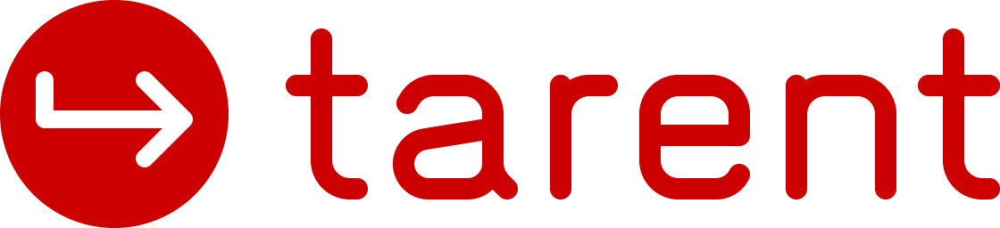
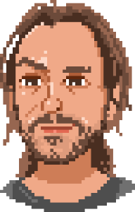
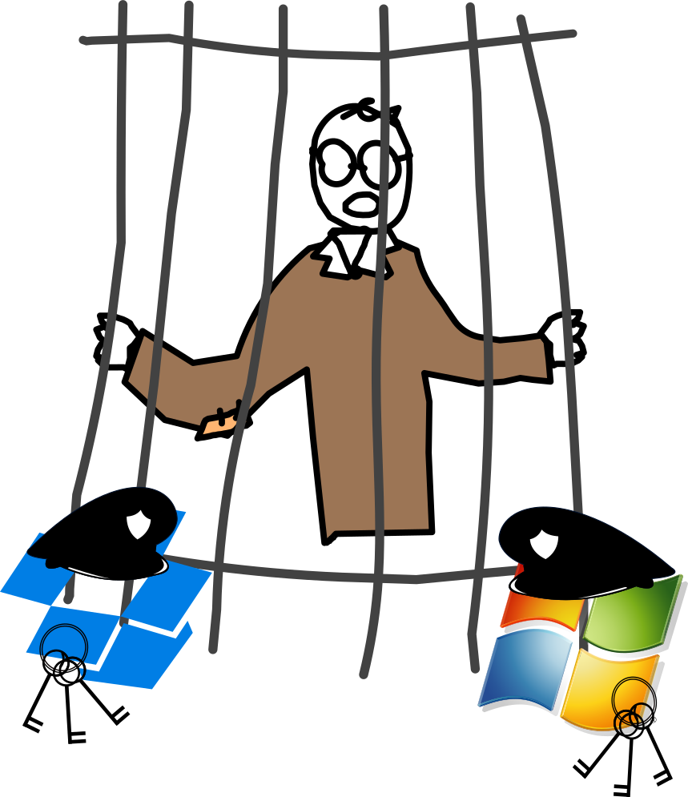
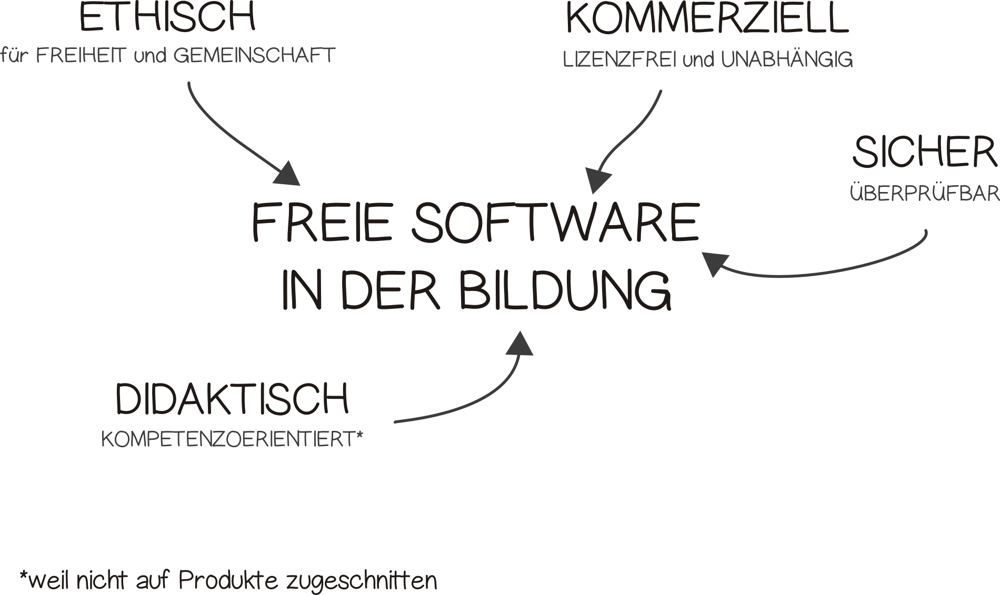

<!-- start locally with
	reveal-md PITCHME.md --css slidestyle.css -w --theme white
-->


<!-- For use with marp editor: -->
<!-- $size: 16:9
$author: Adrian Salamon
$date: 2018-08-23
$title: Die unfreie Lehrkraft – Ausbruch aus dem Gefängnis der Abhängigkeit
$theme: gaia
template:invert
-->


# Die unfreie Lehrkraft mit demokratisch pluralistischem Bildungsauftrag in einer von Monopolen geprägten digitalen Welt 

<div class="mydata">
23.08.2018 <br>
Adrian Salamon <br>
tarent solutions GmbH
</div>


----
With (some) illustrations of

```Text
FreeSoftware TEDx slides
Christian Noguera, Valentin Pasquier, Richard Stallman
Released under CC-BY 3.0 license
Copyright 2014
```
<!-- Info: every image without a source is made by Noguera, Pasquier and Stallman -->


<div style="display:none">
## Abstract

Wir leben und arbeiten in einer dystopischen Welt, in der proprietäre Software alles dominiert. Hausaufgaben gibt's per Dropbox, Klausurergebnisse per Facebook und die Klassenfahrt wird offiziell über WhatsApp organisiert. Aber auch während des Unterrichts dominieren unfreie Systeme und Werkzeuge und unsere Lern- und Arbeitsweisen.

Ist das alles mit den Zielen digitaler Medienbildung konform? Könnte Freie Software uns aus diesem Gefängnis der Abhängigkeit befreien?

Beobachtungen aus der Perspektive der Schulinformatik.

----
</div>

## Zur Person

* Früher: Lehrer für Informatik und Geschichte
* Jetzt: Scrum Master bei 



---

<!--footer: Adrian Salamon, 2018. cc-by 4.0 -->


## Was ist Software?

* Programme
* Apps
* Webapps
* Hardwaresteuerung
* …


Note:
 * Text-Code -> Maschinensprache


---

### Freie Software bedeutet, jeder hat die Freiheit…

* das Programm auszuführen wie man möchte.
* die Funktion des Programms zu untersuchen anzupassen. 
* das Programm zu verteilen.
* das Programm zu verbessern. 


Note: 
* Freie Software verkaufen (RedHat/Fedora)
	- Premium: Nextcloud, Seafile, Emby…
* Freies Wissen verkaufen (Wikipedia)


---

### Free Software ≥ Open Source?


* https://www.gnu.org/philosophy/free-software-for-freedom.de.html
* https://www.gnu.org/philosophy/open-source-misses-the-point.de.html

Note:
* Free Software Movement
* Github @ Microsoft ?

---

## Aufgaben der Lehrkraft

<div class="fullsize"> 
<ul>
  <li> Vermitteln von Fachinhalten </li>
	<li> Beurteilen </li>
  <li> Erziehen  Werte und Normen im demokratischen Gedanken </li>
  <li> Fördern "digitaler Medien" (Medienbildung) </li>
</ul>
</div>


Note:
* Schulgesetz §2: Bildungs- und Erziehungsauftrag
* Werzeuge <> Medien?

---

### Digitales Lernen – eine Darstellung des dystopischen Alltags

* iPads + AppleTV
* Microsoft Office
* Dropbox
* WhatsApp Gruppenchats
* Smartboard Anwendersoftware


Note:
* Daten speichern: DSGVO
* Daten verteilen: Recht auf Informationelle Selbstbestimmung (Tel-Nr, Name, Adressbuch…)

<!-- Quellen:
	https://www.datenschutzticker.de/2017/07/abmahnung-fuer-whatsapp-nutzer/
-->
---

### Digitale Werkzeuge in der Lehre 
* Betriebssystem
* Bürosoftware
* Texteditor
* Webbrowser
* Bildberarbeitung
* Videoschnitt
* Musikproduktion

* Kommunikationstools
* Social Media

 <!-- image by Adrian Salamon -->


Note:
* Abhängigkeiten durch…
	- Vertrieb
	- falsche "Standards"
	- Gewohnheit

---

### und das Lehrerleben… 
* Dropbox für Materialaustausch
* "Cloudspeicher"-Software von Schulbuchverlagen
* Noteneingabe über eine proprietäre uralt Software
* MS Word. Für alles. Wirklich alles.

 <!-- image modifiedy by Adrian Salamon 2018 -->

Note:
* Bsp: lo-net2
* Monopole werden gelebt und gefördert
* es ist angenehm, sich darüber keine Gedanken zu machen

---


### "Nur" ein Lernwerkzeug?

* § 99 NRW SchulG: Sponsoring, Werbung:
	> »Jede Werbung, die nicht schulischen Zwecken dient, ist in der Schule unzulässig.«
* Produktkenntnis vs. Fachkompetenz?


Note: §99 Sponsoring, Werbung
	- Kein Produkt, wohl aber Kompetenzen zur Benutzung vermitteln!
	- Windows, Apple, Whatsapp,…

---

### Womit wollen wir arbeiten?


* Standards müssen offen und zugänglich sein
* Es gibt keine "must have" Software / Industriestandards! 
* Zeigt fehlende Kompetzenzorientierung in der Medienbildung!

 <!-- Remix of following images: http://valsparchampionship.com/microsoft-word-icon/  http://www.myiconfinder.com/icon/photoshop-ps-metro-ui-adobe-logo-application-design-software-edit-file-format/12439 -->

Note:
* Industrie will sogar freie Geister!
	- lieber Typographie statt Präsentationsanimationen
* Klickkompetenz
	- Beim nächsten Update: Keiner kann etwas
* Investition in herstellerunabhängige Fertigkeiten ist nötig!
* Software und dazugehörige Arbeitsweise mit Bedacht wählen!


---


### Lehrkraft und Computer – Wer kontrolliert wen?

* Wenn ich nicht nutzen kann, wie soll ich dann gestalten?
* Vorbild: Kompetente Lehrkraft?


Note:
* Wer darf was auf Schulrechner installieren? Nicht jede Lehrkraft
* Was dürfen Schülerinnen installieren? Gar nichts.
* Einschränkungen vermitteln ein _Bild von Hilflosigkeit_, wenn wir doch eigentlich _Hilfe zur Selbsthilfe_ geben wollen und zeigen wollen, dass wir in der Lage sind die Maschine zu kontrollieren, nicht umgekehrt.


---

## (einige) Aspekte Freier Software 

* Vertrauen
* Unabhängigkeit
* Anpassbarkeit

 <!-- image created by Adrian Salamon 2018 CC-BY -->

Note:
 * Sicherheit: Transparenz und Offenheit statt Abschottung und Geheimhaltung
 * siehe: Geschichte der Kryptographie (Simon Singh?)


---

### Vertrauen
#### "Macht das Programm genau das, was ich will?"

* proprietär = Blackbox
* Wie objektiv kann ein proprietäres Werkzeug sein?


Note:
* Objektiv?: Es muss geeicht sein von einer unabhänigen Stelle
	- Fleischer, bestelle 500g Hackfleisch, kurz unter den Tresen
* Was, wenn…
	- Google/Facebook/etc. bestimmte Beiträge rausfiltert?
	- meine Entwicklungsumgebung nur noch eine Programmiersprache unterstützt?
	- unsere Regierung abhängig vom den größten amerikanischen Unternehmen ist?

---

### Unabhängigkeit

#### "Unser Lizenzvertrag mit XY läuft noch 5 Jahre…"

* keine Verpflichtungen
* offen für neue Anforderungen
* am Bedarf orientiert
* _⇒ Freie Schnittstellen/Formate verwenden!_


Note:
* SaaS: §3 Schulische Selbstständigkeit, Eigenverantwortung, Qualitätsentwicklung und -sicherung
	- selbst die geeignete Software auswählen
	- selbst hosten
* reagieren auf Veränderungen (Windows Phone, Laserdisk) 

---


### Anpassbarkeit
#### "Wir brauchen das ein bisschen anders…"
* (graphical) user interface anpassen
* Kompontenten ändern
* Rechteverwaltung


Note:
* Individuell und differenziert: Wie im Unterricht!
* Ebene Konfiguration oder Kompilierung

---

### FOSS als Grundlage digitaler Selbstverteidigung
* sehen/bearbeiten/lesen von Quelltext
* Wahlmöglichkeiten 
* keine Lizenzgebüren 
* Schutz vor NSA, Bundestrojaner…
* weniger Einfluss von Konzernen auf unser Konsum- und Kommunikationsverhalten


Note:
* Grundkompetenzen im digitalen Zeitalter
* Weniger Abhängigkeiten von einem bestimmten Hersteller/Marke
* FOSS != kostenlos
* Kann der gläserne Bürger ein mündiger Bürger sein?

---

# Wir müssen etwas ändern!


---

## Lasst uns einen Grundstein legen

* mit Freier Software (Unabhängigkeit)
* an Freier Software (Codeanalyse)
* für Freie Software (Erziehungsauftrag)
* Ethik in der Informatik an Hochschulen


Note: 
* moralischer Mehrwert (start in der Schule):
	- sharing is caring
	- Erziehung: Einander helfen
	- Empower: Du kannst mit FOSS etwas bewegen, auch gegen Großkonzerne
* mehr Ethik in der Informatik -> Lehrstuhl Informatik in Bildung und Gesellschaft (Wolfgang Coy)

---

### (richtige) Aufgaben der Lehrkraft bezüglich digitaler Werkzeuge

* zielgerichtet einsetzen
* bewusst gestalten
* Bewusstsein schaffen
* Alternativen würdigen
* Mündigkeit ermöglichen


Note:
* Befähigen zum zielgerichtetem Einsetzen von Software
* Befähigen zur Gestaltung von von Informatiksystemen
* Mündiges leben mit Informatiksystemen vermitteln und vorleben

---


### Freie Alternativen im Bildungsalltag

* __Firefox/Chromium__ statt Google Chrome/Safari/Edge
* __Seafile__ statt Dropbox
* __Diaspora__ statt Facebook
* __GnuSocial__ statt Twitter
* __Moodle__ statt [nicht Moodle]
* __Conversations/Signal__ statt WhatsApp
* __Libre Office__ statt Microsoft Office
* __NextCloud__ als Daten- und Kommunikationsplattform

 <!-- image created by Adrian Salamon 2018 CC-BY -->

Note:
	(verschlüsselte) Dateiablage, Kalender, Kontakte, (Video-)Chatplattform, kollaboratives Arbeiten uvm.

---
### Linksammlung für Softwareempfehlungen

| Link | Beschreibung  |
|:------------ |:-------------|
|https://prism-break.org/de/ | Alternativen zu proprietärer  Software 
|https://github.com/Kickball/awesome-selfhosted | (freie) Software selber hosten

 <!--image taken from https://soldecom.com/wp-content/uploads/2016/05/Picture1.png -->

---
# Vielen Dank

Note:
* Zuhörer
* Veranstalter
* tarent


